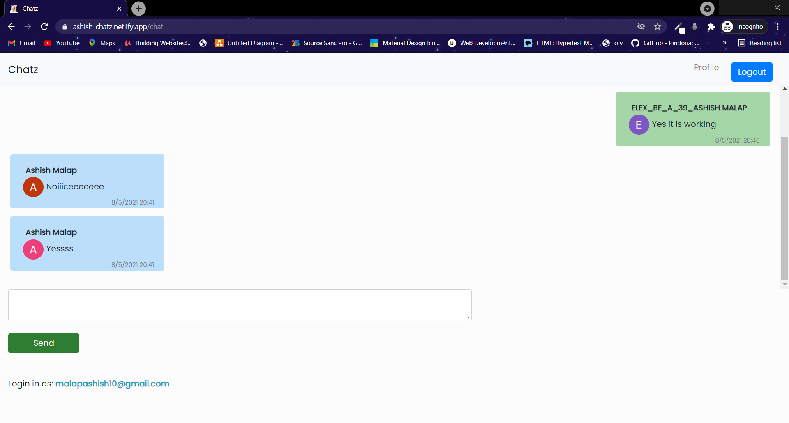

# Chatz
> A simple chat application created using React , Firebase , bootstrap  
> [Live Demo](https://ashish-chatz.netlify.app/)

## Table of contents
* [General info](#general-info)
* [Screenshots](#screenshots)
* [Technologies](#technologies)
* [Setup](#setup)
* [Features](#features)
* [Status](#status)

## General info
The project is a simple chat application built using React. For backend Firebase is used. React routing is also used for routing. For styling along with personal styles bootstrap is used. For authentication Google Auth is used provided by Firebase.

## Screenshots

Home Page 

Login Page

Chat Page

## Technologies
* React - version 17.0.2
* react-router - version 5.0.2
* Firebase - version 8.5.0
* Bootstrap - version 5.0.0

## Setup

In the project directory, first install all the dependenices run:
## `npm install`

To start the project in the project directory run:
## `npm start`

## Features
List of features ready and TODOs for future development
* Authentication
* Responsive

To-do list:
* Chat Room
* User Avatar

## Status
Project is : _in progess_
